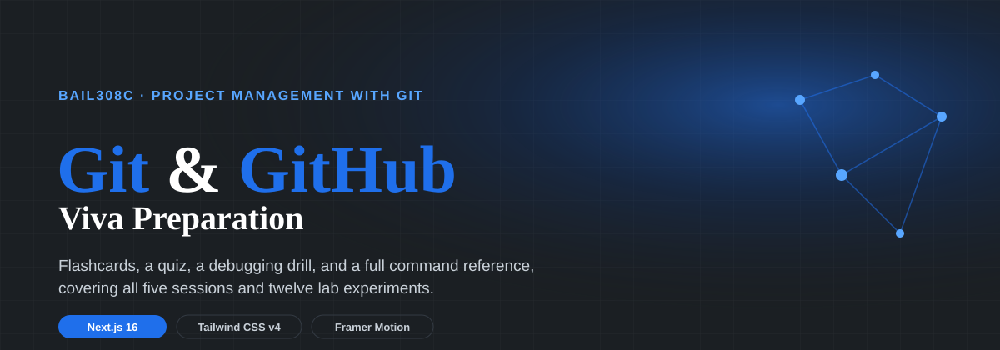
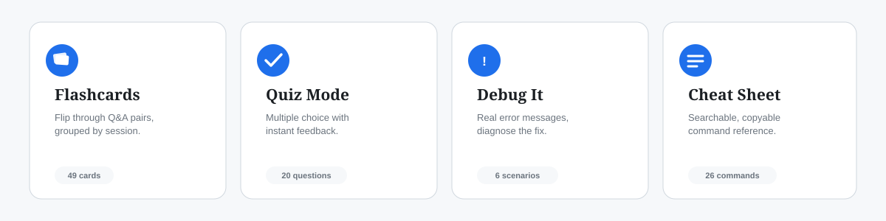

# viva.prep



<p>
  
  
  
  
  
  
</p>

A Git and GitHub viva preparation site built for **BAIL308C, Project Management with Git**.
Flashcards, a quiz, a debugging drill, and a full command reference, covering all five
lab sessions and all twelve lab experiments in the syllabus. No backend, no sign-up,
no tracking, everything runs in the browser.

**Live site:** [git-github-by-abhirai2006.netlify.app](https://git-github-by-abhirai2006.netlify.app/)



## What's inside

| Page | What it does |
|---|---|
| `/` | Landing page: an animated hero, live stats, a rotating 3D commit-graph sculpture, and a personal progress dashboard read back from the browser's own storage |
| `/flashcards` | 49 question-and-answer pairs across all 5 sessions, 3D flip animation, session filters, star-to-review, full keyboard support |
| `/quiz` | 20 multiple choice questions, pick a session or run the full set, instant feedback with explanations, confetti on a strong score |
| `/debug` | 6 real Git error messages, diagnose the actual problem and pick the correct fix |
| `/cheatsheet` | Every command from the 12 experiments, searchable, with one-click copy |

Nothing here needs a server. Starred cards, quiz best score, and review progress are
all stored in `localStorage`, on the visitor's own device.

## Tech stack

- **[Next.js 16](https://nextjs.org/)** (App Router, static export)
- **TypeScript**, strict mode
- **[Tailwind CSS v4](https://tailwindcss.com/)**, CSS-first theming
- **[Framer Motion](https://motion.dev/)** for scroll reveals, page transitions, and the card-flip and pill animations
- **[three.js](https://threejs.org/)** for the rotating commit-graph sculpture on the homepage
- **[canvas-confetti](https://www.npmjs.com/package/canvas-confetti)** for the quiz and debug-drill celebration bursts
- **Geist & Fraunces**, self-hosted, no external font requests at runtime

## Getting started

```bash
npm install
npm run dev
```

Open http://localhost:3000

```bash
npm run build   # static export, output goes to ./out
npm run lint    # ESLint, zero warnings expected
```

## Deploying to Netlify

The project is already configured for a static export (see `next.config.ts` and
`netlify.toml`), so Netlify needs no extra setup beyond pointing it at the right folder.

**Connect a Git repository (recommended):**
1. Push this folder to a GitHub repository, **including** the `app/`, `components/`,
   and `lib/` folders. If you're uploading through GitHub's website rather than the
   command line, drag those folders in directly rather than their contents one file
   at a time, browser-based uploads are known to drop nested folders otherwise.
2. On Netlify, choose **Add new site -> Import an existing project**, and select the
   repository.
3. Build command: `npm run build`. Publish directory: `out`. Both are already set in
   `netlify.toml`, so Netlify picks them up automatically.
4. Every push to the repository redeploys the site.

**Drag and drop, no Git required:**
1. Run `npm install && npm run build` locally.
2. Drag the generated `out/` folder onto Netlify's manual deploy page.

## Project structure

```
viva-prep/
├── app/
│   ├── page.tsx              # homepage
│   ├── layout.tsx            # root layout, fonts, theme script
│   ├── globals.css           # design tokens and keyframes
│   ├── flashcards/page.tsx
│   ├── quiz/page.tsx
│   ├── debug/page.tsx
│   └── cheatsheet/page.tsx
├── components/
│   ├── Hero.tsx, StatsSection.tsx, FeatureCards.tsx, GraphSection.tsx
│   ├── GitGraphOrb.tsx        # the three.js sculpture
│   ├── FlashcardDeck.tsx, QuizRunner.tsx, DebugRunner.tsx, CheatSheet.tsx
│   └── Nav.tsx, Footer.tsx, ThemeToggle.tsx, SessionFilter.tsx
├── lib/
│   ├── vivaData.ts            # all flashcard content
│   ├── quizData.ts            # all quiz questions
│   ├── debugData.ts           # all debug scenarios
│   └── commandData.ts         # the cheat sheet reference
└── docs/                      # README images
```

## Editing the content

Everything the site displays lives in four plain TypeScript files. Add, edit, or
remove an entry and it updates everywhere it's used, including the homepage stats:

- `lib/vivaData.ts` - flashcards
- `lib/quizData.ts` - quiz questions
- `lib/debugData.ts` - debugging scenarios
- `lib/commandData.ts` - the cheat sheet

## Design notes

The palette is built from GitHub's own dark-theme accent blue (`#1F6FEB`, tinting to
`#58A6FF`), rather than a generic default. The homepage sculpture is an original
piece, an icosahedron with a node at each of its 12 vertices, meant to visualize a
repository as a graph of connected commits, not a reproduction of any logo or
trademarked mark.

## Credits

Built by **Abhishek Rai A** for the BAIL308C Git and GitHub lab course, University of
Mysore School of Engineering.

Portfolio: https://portfolio-abhirai2006.lovable.app/
